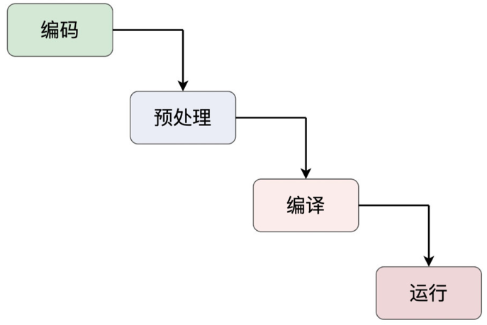
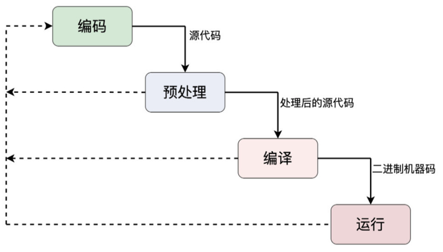
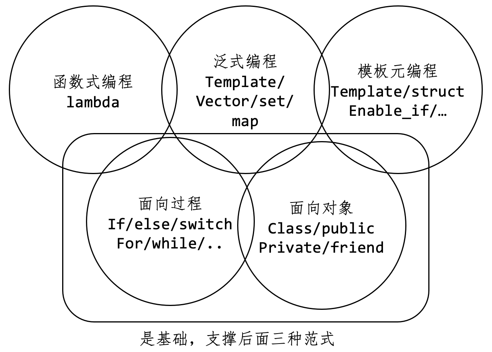

# 罗剑锋的C++实战课程

## 第一节课程

### Overview：

一个C++程序从“诞生”到“消亡”，要经历如下的阶段：

- 编码（Coding）
- 预处理（Pre-processing）
- 编译（Compling）
- 运行（Running）

#### 编码（Coding）

编码是什么？编码其实就是我们在写程序的这一个过程：定义变量、写语句、实现各种数据结构、函数和类。其最基本的要求是要遵循语言规范和设计文档，还有代码的规范，注释的规范，设计模式，和编程惯用法等。

在编码之后，就是来到了预处理阶段。

#### 预处理（Pre-processing）

所谓的预处理，其实是相对于下一个阶段“编译”而言的，在编译之前，预先处理一下源代码，既有点像是编码，又有点像是编译，是一个中间的阶段。

预处理也是C++/C 所独有的阶段，其他编程语言都没有。

在这个阶段，发挥作用的是预处理器（Pre-processor）。源码文件（编码阶段）→ 预处理器 → 经过“预处理”的源码文件。“预处理”的目的是文字的替换，用到的就是我们熟悉的各种预处理指令，比如`#include`、`#define`、`#if`等，实现“预处理编程”。

对于预处理，其都是以符号“#”开头，虽然是C++程序的一部分，但严格来说不属于C++语言的范畴，因为它走的是预处理器。

在预处理之后，就进入到编译阶段。

#### 编译（Compling）

准确的说，应该是编译和链接（Linking）。

在编译阶段，C++ 程序-也就是经过预处理的源码-要经过编译器和链接器的 "锤炼"，生成可以在计算机上运行的二进制机器码。这里面的讲究是最多的，也是最复杂的，C++ 编译器要分词、语法解析、生成目标码，并尽可能地去优化。

在编译之后，有了可执行文件，C++程序就可以跑起来了，进入运行阶段。

#### 运行阶段（Running）

这个时候，“静态的程序”被载入内存，由于CPU逐条语句执行，就形成了“动态的进程”。

运行阶段也是我们最熟悉的了。在这个阶段，我们常做的是 GDB 调试、日志追踪、性能分 析等，然后收集动态的数据、调整设计思路，再返回编码阶段，重走这个 “瀑布模型”，实 现 "螺旋上升式" 的开发。

#### “蝴蝶效应”与“混沌理论”

一个Bug在越早的阶段发现并解决，它的价值就越高；一个Bug在越晚阶段被发现解决，它的成本就越高。所以，依据这个生命周期模型，我们应该在 “编码” “预处理” “编译” 这前面三个阶段多 下功夫，消灭 Bug，优化代码，尽量不要让 Bug 在 “运行” 阶段才暴露出来，也就是所谓 的 "把问题把杀在萌芽期"。

### C++语言的编程范式

什么是编程范式？“编程范式”是一种“方法论”，就是指导我们编写代码的一些思路、规则、习惯、定式和常用语。

C++是一种多范式的编程语言。现代C++（11/14以后）支持：

- 面向过程
- 面向对象
- 泛型
- 模板元
- 函数式

其中，“面向过程”“面向对象”是基础，支撑后三种范式。

#### 面向过程

面向过程时C++里面最基本的一种编程范式，他的核心思想是“命令”，通常是顺序执行的语句，把任务分解成若干个步骤去执行，最终达成目标。

例子：变量的声明，表达式，分支/循环/跳转语句，等。

#### 面对对象

他的核心是“抽象”和“封装”，倡导的是把任务分解成为一些高内聚低耦合的对象，这些对象相互通讯协作来完成任务。强调的是对象之间的关系和接口，而不是完成任务的具体步骤。

例子：`class`、`public`、`private`、`virtual`、`this`

#### 泛型编程

来自STL纳入到C++标准后才逐渐流行起来的新范式，核心思想是“一切皆为类型”，使用模板而不是继承的方式来复用代码，所以运行效率更，代码也更简洁。

C++里，泛型的基础就是template关键字，然后是标准库STL。

#### 模板元编程

它的核心思想是“类型运算”，操作的数据是编译是可见的“类型”，所以也比较特殊，代码只能有编译器执行，而不能被运行的CPU执行。

例子：用的比较少，type_traits、enable_if。

#### 函数式

核心思想是“一切皆可调用”，通过一系列连续或者嵌套的函数调用实现对于数据的处理。

#### 出发点

“尽量让周围的人都能看懂的代码”，所以常用的范式是“过程+对象+泛型”，再加上少量的“函数式”，慎用“模板元”。

